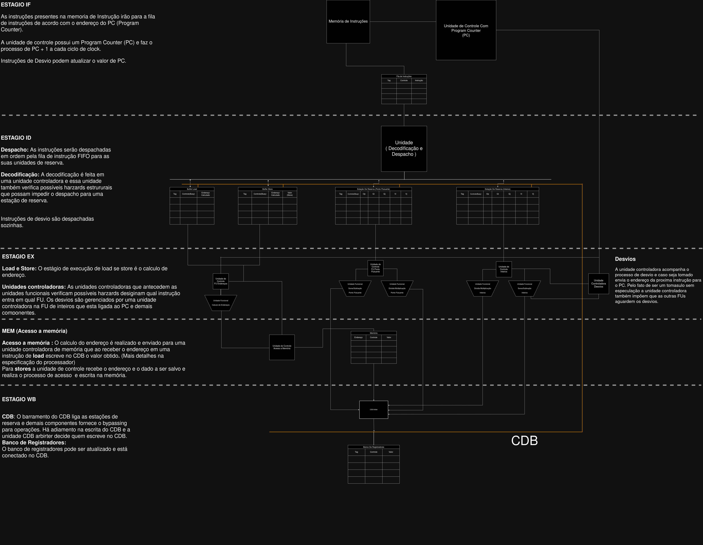

# Tomasulo Algorithm Diagram

This project contains a diagram of the Tomasulo algorithm, which is used for out-of-order execution in processors. The diagram visualizes key components of the algorithm, including reservation stations, register renaming, common data bus (CDB).

## Diagram Overview

- The diagram illustrates the dynamic scheduling of instructions.

## How to Open the Diagram

1. Download the `TomasuloDiagram.drawio` file from this repository.
2. Open it in [Draw.io](https://app.diagrams.net/) to view and edit the diagram.

## Technologies

- **Draw.io** (or any compatible diagram tool) to open and edit the diagram.

## License

This project is licensed under the MIT License.

## Tomasulo Diagram

Below is an image representation of the Tomasulo algorithm:

